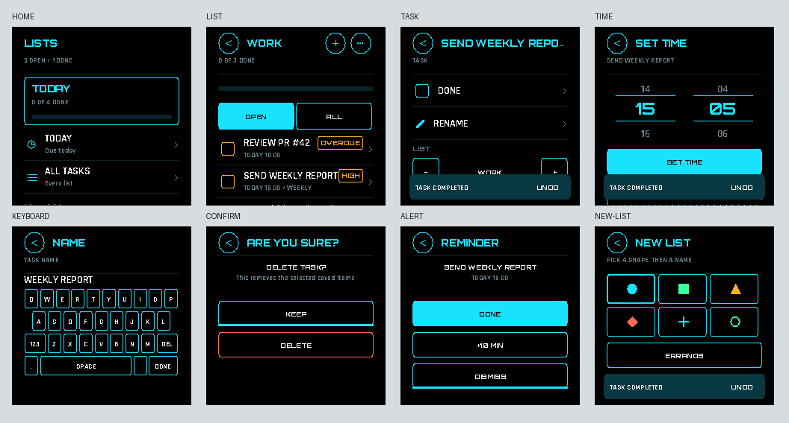
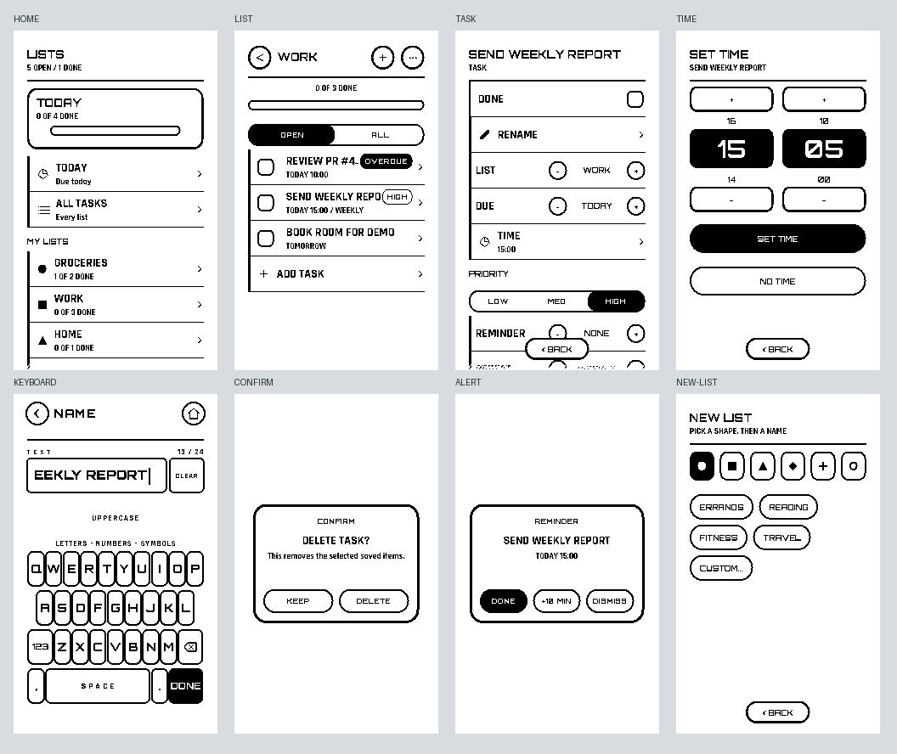
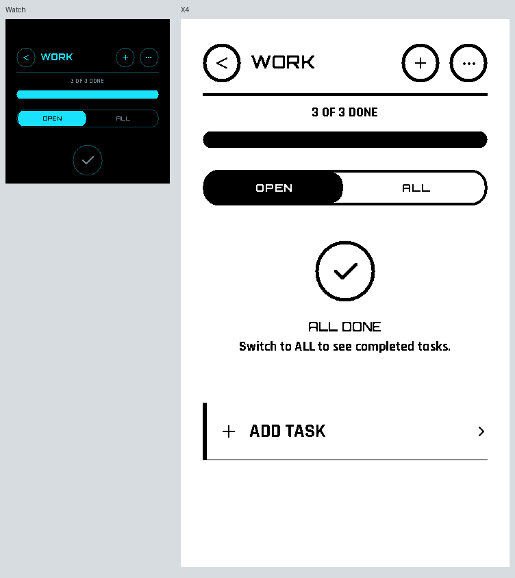
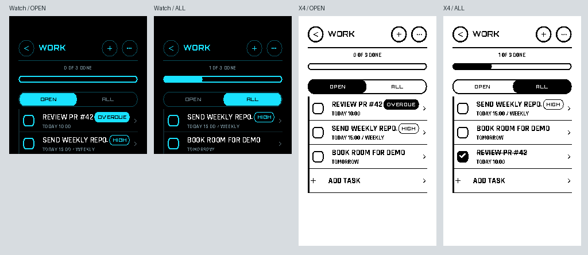

# Lists: one intent app for Watch and X4

Lists uses the shared NOVA component presenter from RiscRTE-System-Apps.
`Apps/ListsScene.c` declares semantic content and handles intents. It contains
no display/touch calls, coordinates, fonts, product IDs, or conditional device
layouts. `Apps/lists_scene.c` handles service custody, atomic saves and optional
resident-shell checkpoints. The same compiled `lists.elf` serves both products.






These images are generated by the actual C presenter with fixture data, in this
order: Home, list, task, time, keyboard, confirmation, reminder, new list. Fixture
data is never seeded into the installed application. The additional completed
capture verifies the mockup's 44px circle and 20px check. Confirmation/reminder
copy uses explanatory text instead of the completed-state component. The
separate tab sheet shows both selections, including a completed task in ALL.
The fixture also captures list options and task suggestions.

The renderer follows the attached mockup
`Lists (To-Do) — NOVA-7 watch + e-ink(1).html` for the control hierarchy:

| Mockup element | Shared component |
| --- | --- |
| OPEN / ALL and priority tabs | Single rounded rail with inset selected segment and 8px labels |
| List, date, reminder and repeat selectors | Inline label, value and minus/plus stepper |
| Suggested names | Wrapping, content-sized chips |
| List shapes | One row of six selectable shapes |
| Show completed | Compact OFF/ON capsule |
| Confirmation and reminder | Centered dialog with horizontal action buttons |
| Task completion | Checkbox with separate detail target; trailing checkbox in task details |
| Time | Watch wheels; inverted value cards and +/- controls on paper |

The existing shared native keyboard remains the text-entry surface; its extra
editing/layer controls are intentionally retained. These binary/font-raster
captures are implementation renders, not browser screenshots or a claim of
pixel identity with browser font antialiasing.

## Behavior

- Today, All Tasks and custom lists; OPEN/ALL filters and per-list completed visibility.
- Add suggested or custom tasks and lists; six color/shape markers; rename and move tasks.
- Separate completion and detail actions, counts, progress, priority and overdue badges.
- Absolute saved civil dates, due time, priority, reminder and daily/weekly repeat rules.
  “This week” means the end of the current civil week (Sunday).
- Repeating completion creates the next occurrence once; undo/recheck does not duplicate it.
  Missed occurrences advance to the next future cadence. Capacity errors leave the task unchanged.
- Confirm deletion, clear completed, keep/cancel, and Watch Undo. Paper omits Undo.
- Native text entry, Watch time wheels, X4 +/- time controls, continuous scrolling.
- Resident X4 Quick Actions through the existing host, with close/checkpoint/reopen custody.
  Current task and in-memory draft survive that handoff; the app links no shell renderer.

Reminders are **foreground reminders**, matching the supplied mockup's active
checking loop. They alert while Lists is open and surface missed reminders on
return. DONE, +10 MIN and DISMISS are persisted. This version does not create a
background wake alarm or modify the existing alarm/Points scheduler. The task
detail screen states this behavior.

## Data and recovery

Up to 12 lists, 64 tasks, and 24 printable ASCII characters per name. Names are
normalized to uppercase. Fresh storage starts empty. No network/device sync is
implied: each device owns its Lists namespace.

`lib/Lists` is independent of UI and hardware. It uses a versioned, bounded,
little-endian file with CRC and explicit validation. Saves use app-data revision
checks and atomic replacement. Every attempted save reloads authoritative data;
STALE/COMMIT_UNKNOWN never causes a blind retry or a second recurring task.
Corrupt/unavailable storage opens a retry screen and is never replaced with empty
content. Terminal provider/native context loss stops all further I/O and cleanup.

Dates cover 2000–2099. Calendar interpretation comes from the separate read-only
`time.civil@1` policy provider. Invalid clock state disables date editing and
reminder detection while leaving ordinary undated lists usable.

## Build and test

Use a Runtime SDK that includes app-data, the resident-shell contract and platform
realtime. CI uses public Runtime commit
`a9587bec00015ad56c302192a8359b6d70cde01a` and System commit
`efed0cc6ffd82ff60363132fba8da32285533b3e`. The `Lists shared scene build`
workflow tests both renders and publishes the app/providers as build artifacts.

```sh
python ../System/scripts/build_scene_services.py --runtime ../Runtime --output ../build/scene
python ../System/scripts/build_civil_clock.py --runtime ../Runtime --output ../build/civil
python scripts/build_lists_scene.py --runtime ../Runtime --system-apps ../System --output ../build/lists
python scripts/test_lists_scene.py --runtime ../Runtime --system-apps ../System --frames ../build/frames
```

The builder recompiles the app in a second directory and requires identical ELF
hashes, then checks Xtensa ELF structure, imports and exports. The tests run the
model, storage protocol, real application lifecycle and actual shared renderer.
They cover every civil day in range, recurrence idempotence and full capacity,
byte corruption, failed/uncertain saves, editing/reminder flows, separate row
hit targets during a pending frame, tab switching without changing routes,
disabled/gap targets, modal inside/outside cancellation, wrapped chip intents,
and close/storage context loss. Pixel checks guard both tab selections and the
completed circle on both profiles. Run
`python scripts/render_lists_previews.py --frames ../build/frames` to regenerate
the review sheets from the C captures (requires Pillow). System's
179 legacy scene cases also pass with the extended presenter.

Profile preservation tests use frozen SHA-256 values from public checkpoint
`f92741176b137d331cce9746462b1ff043337aac`, so shallow CI checkouts do not need
unpublished historical commits. Version expectations track the recovered
Timecard 0.2.9 manifests; no profile versions or authority were changed.

## Device composition

`deployment/lists/watch.json` selects compact color, the Watch RTC policy and
namespace 62. `x4.json` selects portrait monochrome and native UTC plus the
installed timezone preference, with its isolated Lists namespace 63. The composer refuses a namespace collision,
ambiguous provider, provider downgrade, missing catalog app or capacity overflow.
It upgrades the shared presenter in place when already present, adds the app to
resident foreground admission where applicable, and preserves other apps and
user files.

```sh
python scripts/compose_lists_scene.py \
  --store ../product-store \
  --system-packages ../build/scene --clock-packages ../build/civil \
  --lists-packages ../build/lists --profile deployment/lists/x4.json \
  --catalog ../installed-launcher-catalog.json --output ../build/x4-lists-stage
```

The output includes `store/`, `launcher-catalog.json` and a custody receipt.
Both verified store compositions contain 27 providers, within the selected
28-provider profile. Rebuild the product launcher from the emitted complete
catalog, verify linked native capacity, and bind the final product cohort before
making an install image. The stage deliberately removes an obsolete cohort
identity and labels itself non-flashable. Existing firmware binaries are not
silently relabeled or published as upgraded images.

No physical-device flashing or hardware accuracy/latency claim is made by these
host tests. See `docs/lists/verification.json` for exact build hashes and scope.
